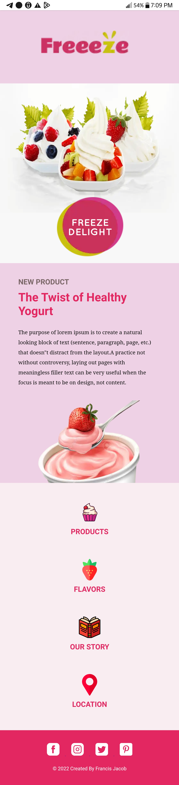

# Freeeze Yoghurt project

Home page for fictional Yoghurt Restaurant, Created with HTML and CSS.


## Table of contents

- [Overview](#overview)
  - [Screenshot](#screenshot)
  - [Links](#links)
- [My process](#my-process)
  - [Built with](#built-with)
  - [What I learned](#what-i-learned)
  - [Continued development](#continued-development)
  - [Useful resources](#useful-resources)
- [Author](#author)


## Overview

### Screenshot



### Links

- Live Site URL:[ Live site URL ](https://jacbfrancis.github.io/Freeze-Yoghurt-webpage-/)

## My process

### Built with

- Semantic HTML5 markup
- CSS custom properties
- Media Queries 

### What I learned

I learnt how to use relatve and absolute positioning to move and place elements in a webpage.


```css
.heading{
    width: 75%;
    left: 100px;
    position: absolute;
    top: 150px;
}
```

```css
middle{
    margin-top: -4px;
    width: 100%;
    height: 1200px;
    position: relative;
}
```


### Continued development

- Building responsive layouts.
- Learn CSS Flexbox.

### Useful resources

- [Flat Icon](https://www.flaticon.com) - This helped with nice icons/images. I really liked this Website and plan to use it going forward.

## Author

- Website - [ Francis Jacob](https://github.com/Jacbfrancis)
- Twitter - [@jacobxavier_](https://twitter.com/jacobxavier_?t=YdJHQngdQYJVbC7mWspqDg&s=08)
